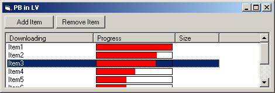



## ProgressBar in a ListView column

### Description

Here you have it the source code for adding a progress bar to a listview control, similar to Napster and iMesh. I have brought the problems down to one and that is the Horizontal Scrollbar so if anyone figures this one lemme know. The code now refreshes of of the WM_PAINT message so it's super effiecient. Happy Coding!
 
### More Info
 

             |
---                |---
**Submitted On**   |2000-11-28 00:02:36
**By**             |[Joshua Bussdieker](https://github.com/Planet-Source-Code/PSCIndex/blob/master/ByAuthor/joshua-bussdieker.md)
**Level**          |Intermediate
**User Rating**    |4.5 (27 globes from 6 users)
**Compatibility**  |VB 6\.0
**Category**       |[Custom Controls/ Forms/  Menus](https://github.com/Planet-Source-Code/PSCIndex/blob/master/ByCategory/custom-controls-forms-menus__1-4.md)
**World**          |[Visual Basic](https://github.com/Planet-Source-Code/PSCIndex/blob/master/ByWorld/visual-basic.md)
**Archive File**   |[CODE\_UPLOAD1215111282000\.zip](https://github.com/Planet-Source-Code/joshua-bussdieker-progressbar-in-a-listview-column__1-13137/archive/master.zip)

